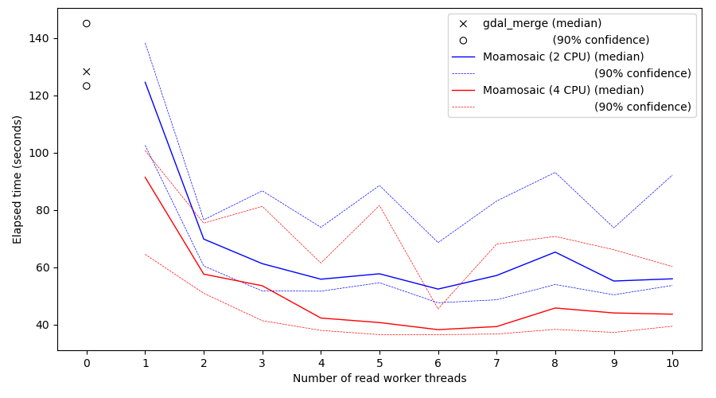

# Performance
## Introduction

To assess the value of Moamosaic, a set of tests were run, on 
some AWS virtual machines. The input data was a set of Sentinel-2 satellite
imagery tiles stored on an S3 bucket, specifically the COG GeoTiffs in the
`sentinel-2-l2a` bucket. A set of 9 tiles (i.e. 3-by-3 tiles) was selected to 
make a mosaic. The mosaicing was repeated with different numbers of read worker 
threads, to show the impact on the time taken to complete the job.

The same mosaic was also created using `gdal_merge.py`, for comparison.

## Methods
When running on a virtual machine (VM), with input data on an S3 bucket, the 
variability in performance is rather high. To make comparisons clearer, 
multiple runs were performed for each case, giving a statistical distribution
of elapsed times. The number of runs for each case was chosen as 40, 
a bit arbitrarily. More would be statistically better, but would cost more
and take longer. 

The authors were unsure what cache techniques are involved in the AWS systems, 
so each separate run was using a different imagery date, ensuring that the files
were new each time.

The VMs used were in the same AWS region as the S3 bucket in question. Two 
different VM configurations were tested, one with 2 CPUs and one with 4 CPUs.

## Results
The vertical axis shows elapsed time to create a 3x3 mosaic. The horizontal axis
shows the number of read worker threads used. 

There are three main datasets shown. The markers on the left show the results
for `gdal_merge.py`, with the median value shown as a cross. The two solid line
plots show the median value for `moamosaic`, as a function of the number of read
workers, for the "2 CPU" case (blue) and "4 CPU" case (red). The dashed lines
show the 90% confidence interval for each, in the same colour. 

## Conclusions
Following just the solid lines (median performance), the main conclusion
immediately visible is that using 2 to 4 read workers gives a substantial
reduction in elapsed time, but greater than 4 workers provides negligible
further benefit.
The use of extra CPUs also provides a smaller but still useful improvement. 

It is likely that other factors would also be important (e.g. if the VM were
in a different AWS region to the data, imposing longer read latencies), so
these results should be seen only as indicative. 
